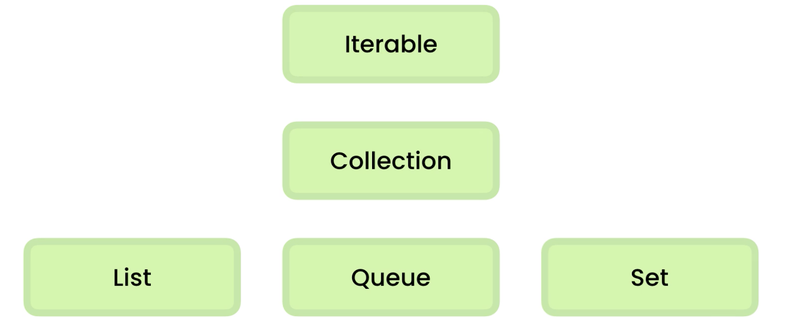

<!-- markdownlint-disable MD022 MD024 MD032 MD033 -->

<p class="toc"><a href="./index.html">&lt;– back to Table of Contents</a></p>

# Description

| Code Log | Start       | End               |
| -------- | ----------- | ----------------- |
| this log | Aug 4, 2020 | November 12, 2020 |

## Challenge & Commitment

Challenge: This is part of Alexander Kallaway's [100DaysOfCode](https://github.com/Kallaway/100-days-of-code "the official repo") challenge. More details about the challenge can be found here: [100daysofcode.com](http://100daysofcode.com/ "100daysofcode.com").

Commitment: I will code daily for the next 100 days.

| Start Date  | End Date          |
| ----------- | ----------------- |
| Aug 4, 2020 | November 12, 2020 |

## Goals

- [x] Code daily
- [ ] Finish Code with Mosh "Java" Series
- [ ] Finish Code with Mosh "JavaScript" Series
- [ ] Finish Code with Mosh "React" Series
- [ ] Finish Udacity React Projects
- [ ] Finish Machine Learning Specialization
- [ ] Finish Machine Learning edx course from UT Austin
- [ ] code 200 solutions for algorithm interview preparation at LeetCode/LintCode

---

# Code Log

## Day3_b. Java Lambda Expression and Functional Interface

### August 6th, 2020 - Thursday

**Project:**

**Notes:**

- anonymous inner class
- lambda expression: lambda expression is actually an object. The difference between anonymous inner class and lambda expression is that lambda expression can not have fields and cannot save states while anonymous inner class can do it. And the `this` keyword means differently. In anonymous inner class, `this` points to the current anonymous class instance while lambda expression's `this` points to current class instance.
  
```java

package com.codewithmosh.lambdas;
import java.util.function.UnaryOperator;

public class LambdasDemo {
  // instance field
  public String prefix = "-";

  public static void show() {
    // anonymous inner class
    greet(new Printer() {
      @Override
      public void print(String message) {
        System.out.println(message);
        System.out.println(this.getClass());
      }
    });

    // lambda expression
    greet(message -> System.out.println(message));
    Printer printer = message -> System.out.println(message);
  }

  public void showAnother() {
    // variable capture
    greet(message -> System.out.println(message + this.getClass()));
  }

  // code against interface
  public static void greet(Printer printer) {
    printer.print("Hello World");
  }

  public static void main(String[] args) {
    show();
    new LambdasDemo().showAnother();
  }
}
```

- Method Reference: following this format: Class/Object::method, this could be used for replacing lambda expression with existing method

```java
greet(System.out::println);
greet(LambdasDemo::printer1);// class method reference
greet(new LambdasDemo()::printer2);// instance method reference 
greet(LambdasDemo::new);//constructor method reference
```

There are 4 types of built-in functional interface: consumer, supplier, function and predicates.

The reason why we use functional interface: [answer](https://www.journaldev.com/2763/java-8-functional-interfaces#:~:text=The%20major%20benefit%20of%20java,a%20lot%20of%20functional%20interfaces.)

I still do not fully understand the actual use case of functional interface. My best guess is the same as the reason why we use interface, that is, coding against interface. And for customized implementation, we could provide later.

**Links:**

[exercise repo](https://github.com/caffeineGMT/Java_Learning/tree/master/UltimateJava_Part3/src/com/codewithmosh/lambdas)

## Day3_a. Main method in Java

### August 6th, 2020 - Thursday

**Project:** Question: Can I have main method in different class? Can it be used for testing if each class has a main method? How does program start by JVM?

**Notes:**
- main method can exist in each class, it is just a starting point of a program
- multiple main methods existed in different class can be called simultaneously
- multiple main methods existed in different class can be used for unit testing

**Links:**
- [solution repo](https://github.com/caffeineGMT/Java_Learning/tree/master/UltimateJava_Part3/src/com/codewithmosh/MainMethodTesting)
- see [explanation](https://csis.pace.edu/~bergin/KarelJava2ed/ch2/javamain.html#:~:text=In%20Java%2C%20you%20need%20to,in%20a%20real%20Java%20program.)

## Day 2_b. Java Interface reference variable

### August 5th, 2020 - Wednesday

**Project:** It is confusing to see statement below:

`Printable objParent = new Parent();` where Printable is an interface, Parent implement it. But when creating a reference variable, we create an interface type and assign it to a class instance which implement the interface.

The complete code snippet is below:

```java
public class OverridenClass
{
    public static void main(String[] args)
    {
     Printable objParent = new Parent();
     objParent.sysout();
     objParent.displayName();
    }
}

interface Printable
{
    void sysout();
}

class Parent implements Printable
{
    public void displayName()
    {
     System.out.println("This is Parent Name");
    }

    public void sysout()
    {
        System.out.println("I am Printable Interface in Parent Class");
    }
}
```

**Notes:**

- Interface is like a class, but no concrete implementation. Other than that, they are very much alike when using.
- Interface type is like abstract method, force whoever implement it to provide concreted implementation
- The Printable Interface is like the parent class of Parent class. So when using Printable interface reference type to assign to an instance, this instance can only access the method belongs to the Printable Interface portion. In this case, it can only access sysout() method.

**Links:**

- see [stackoverflow question](https://stackoverflow.com/questions/14997202/creating-object-with-reference-to-interface)
- see [Oracle doc](https://docs.oracle.com/javase/tutorial/java/IandI/interfaceAsType.html)

## Day 2_a. Java Interface reference variable

### August 5th, 2020 - Wednesday

**Project:** Finish the Collection Interface chapter on Ultimate Java Series from Code with Mosh

**Notes:**

[Code Solution](https://github.com/caffeineGMT/Java_Learning/tree/master/UltimateJava_Part3/src/com/codewithmosh/collections)

Interface Hierarchy

Following this hierarchy path, there is another corresponding path of abstract class to provide skeleton implementation details, in order to minimize the effort the implementation of bottom interface. See [link](https://docs.oracle.com/javase/8/docs/api/java/util/ArrayList.html)

- Iterable: See GenericList code solution
- Iterator: See GenericList code solution
- Collection
- List: Using `List<E>` interface, usually implement `ArrayList<E>` class
- Comparable
- Comparator
- Queue: Using `Queue<E>` interface, usually implement `ArrayDeque<E>` class
- Set: Using `Set` interface, usually implement `HashSet<E>` class
- Hash Table: using `Map<K,V>` interface, usually we use `HashMap<K,V>` class. Map is not iterable, if we want to iterate value/key, we need to call several method from map instance.

  | Java | Python     | JavaScript | C#         |
  | ---- | ---------- | ---------- | ---------- |
  | Maps | Dictionary | Objects    | Dictionary |

## Day 1. Java Iterable Interface

### August 4th, 2020 - Tuesday

**Project Description:** trying to understand Java Iterable and Iterator interface

```java
public class GenericList<T> implements Iterable<T> {
    private T[] items = (T[]) new Object[10];
    private int count;

    public void add(T item) {
        items[count++] = item;
    }

    public T get(int index) {
        return items[index];
    }

    @Override
    public Iterator<T> iterator() {
        return new ListIterator(this);
    }

    private class ListIterator implements Iterator<T> {
        private GenericList<T> list;
        private int index = 0;

        public ListIterator(GenericList<T> list) {
            this.list = list;
        }

        @Override
        public boolean hasNext() {
            return index < list.count;
        }

        @Override
        public T next() {
            return list.items[index++];
            // return list.get[index++];
        }
    }
}
```

**Notes:**

- for each loop rely on the the iterable interface and using iterator internally to do iteration
- first we need to implement Iterable interface
- second we need to implement a Iterator interface to generate a iterator
- The reason why we use the private class for ListIterator here is that the generic type T can be passed down from the moment we create a GenericList

**Links:** [Solution repo](https://github.com/caffeineGMT/Java_Learning/blob/master/UltimateJava_Part3/src/com/codewithmosh/collections/GenericList.java)

---
