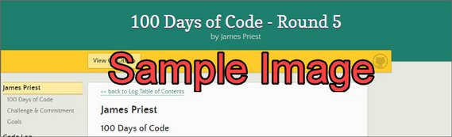

<!-- markdownlint-disable MD022 MD024 MD032 MD033 -->

# 100 Days of Code

<a href="./index.html">&lt;– back to Table of Contents</a>

## Challenge & Commitment

This is part of Alexander Kallaway's [100DaysOfCode](https://github.com/Kallaway/100-days-of-code "the official repo") challenge. More details about the challenge can be found here: [100daysofcode.com](http://100daysofcode.com/ "100daysofcode.com").

**Commitment:** _I will code daily for the next 100 days._

| Start Date  | End Date          |
| ----------- | ----------------- |
| Aug 4, 2020 | November 12, 2020 |

## Goals

- [x] Code daily
- [ ] Finish Code with Mosh "React" Series
- [ ] Finish Code with Mosh "Java" Series
- [ ] Finish Udacity React Projects
- [ ] Finish Machine Learning Specialization

# Code Log

---

## 1. Sample Entry

### Day 1: February 26, 2019 - Tuesday

**Project:** Using Java Iterable interface

**Progress:**

- for each loop rely on the the iterable interface and using iterator internally to do iteration

**Links:** [Solution repo](https://github.com/caffeineGMT/Java_Learning/blob/master/UltimateJava_Part3/src/com/codewithmosh/collections/GenericList.java)

---
